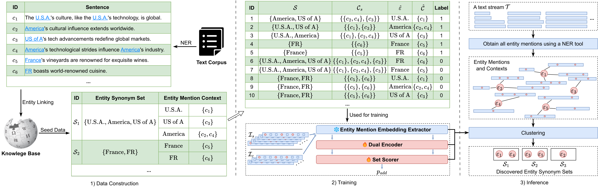
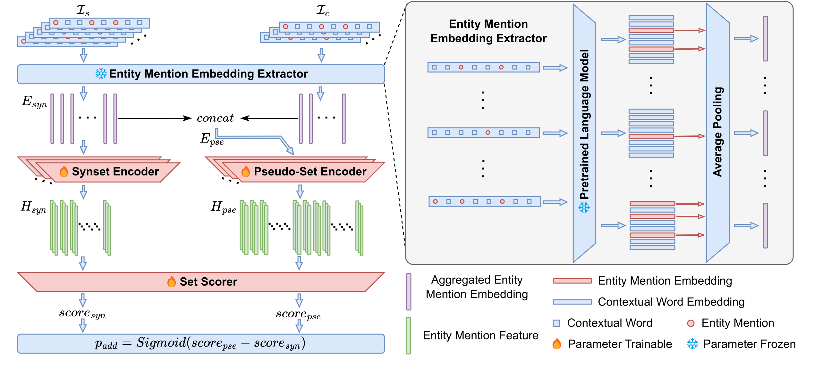

# 🎉 DE-ESD: Dual Encoder-based Entity Synonym Discovery using Pre-trained Contextual Embeddings

---

*Expert Systems With Applications, 2025*  
By Subin Huang*, Junjie Chen* (Equal contribution), Chengzheng Yu, Daoyu Li, Qing Zhou, and Sanmin Liu.

---

Extracting synonymous entities from unstructured text is important for enhancing entity-dependent applications such as web searches and question-answering systems. Existing work primarily falls into two types: statistics-based and deep learning-based. However, these approaches often fail to discern fine semantic nuances among entity mentions and are prone to cumulative errors; thus, they inadequately represent the holistic semantics of entity synonym sets. To address these limitations, this paper introduces a novel framework, Dual Encoder-based Entity Synonym Discovery (DE-ESD). The proposed method initially uses pre-trained language models to extract multiperspective contextual embeddings of entity mentions. Then, it employs a dual encoder architecture to differentiate features between an established entity synonym set and a pseudo-set—created by adding a candidate entity mention to the synonym set. A set scorer evaluates the quality scores of both sets. By leveraging the trained dual encoder and the set scorer, DE-ESD can implement an efficient online algorithm for mining new entity synonym sets for open text streams. The experimental results obtained on two real-world datasets (NYT and Wiki) demonstrate the effectiveness of DE-ESD. Furthermore, we investigated the impact of different pre-trained language models on DE-ESD performance, particularly their ability to extract effective contextual embeddings.

<center>


</center>


## Training

```bash
./scripts/run_training.sh
```

## Evaluation

```bash
./scripts/run_de_esd_cluster.sh
```

## Citation

```bibtex
@article{chen2025deesd,
  title = {DE-ESD: Dual encoder-based entity synonym discovery using pre-trained contextual embeddings},
  journal = {Expert Systems with Applications},
  volume = {276},
  pages = {127102},
  year = {2025},
  issn = {0957-4174},
  doi = {https://doi.org/10.1016/j.eswa.2025.127102},
  url = {https://www.sciencedirect.com/science/article/pii/S0957417425007249},
  author = {Huang, Subin and Chen, Junjie and Yu, Chengzhen and Li, Daoyu and Zhou, Qing and Liu, Sanmin},
  keywords = {Entity synonym set, Entity synonym discovery, Dual encoder, Pre-trained language model, Contextual embedding},
}
```
